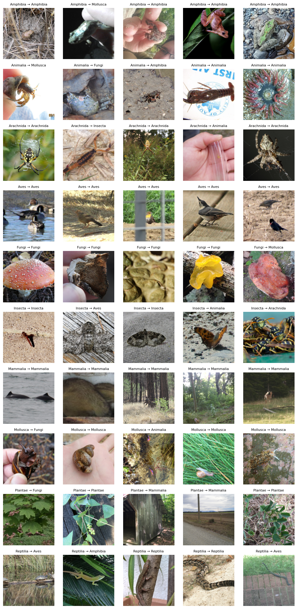
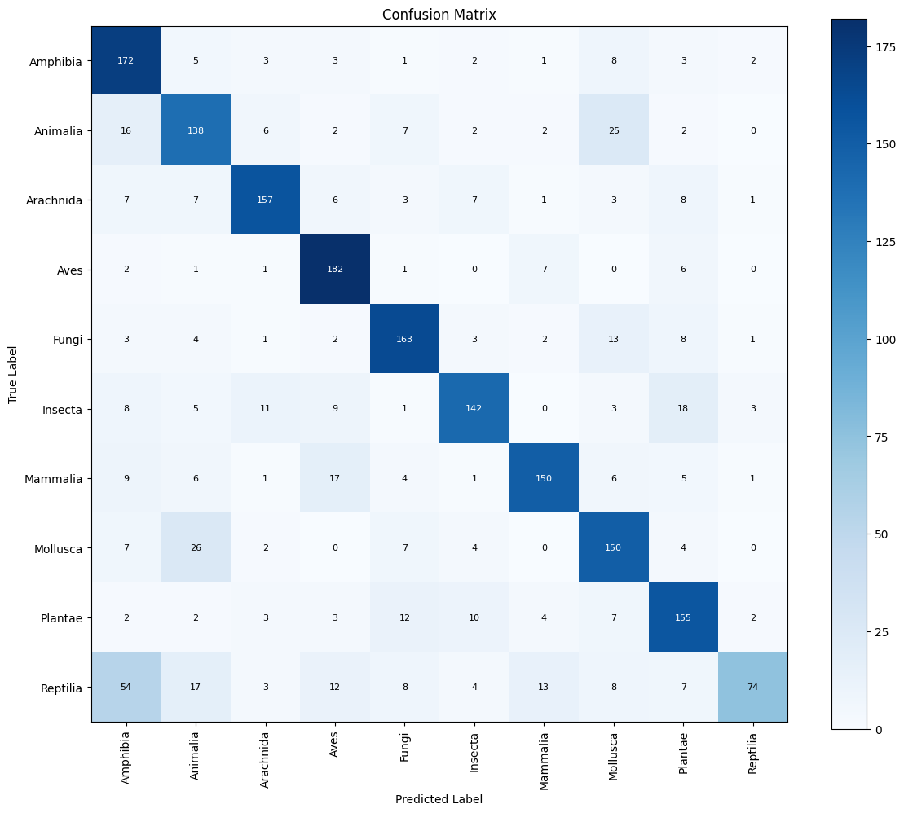

# Fine-Tuning GoogLeNet on iNaturalist_12K dataset

This folder contains the solutions for part B os the assignment.

### Model

The model uses torchvision.models.googlenet with IMAGENET1K_V1 weights.

- Architecture: `GoogLeNet` (with pre-trained ImageNet weights)
- Strategy: 
  - Freeze all layers except `inception5b` and `fc`
  - Replace the final fully connected layer to match the number of classes

### Training

- Loss function: `CrossEntropyLoss`
- Optimizer: `Adam`
- Learning rate: `0.0005`
- Epochs: `10`
- Batch size: `64`

After fine-tuning, the model is saved as googlenet_finetuned.pth

### Evaluation Metrics:
- Accuracy and loss on train/val/test sets
- Confusion matrix (with counts)
- Visualization of predictions (first 5 samples from each class)

### Visual Examples:
- Each row shows 5 images per class with predicted labels

### Confusion Matrix:
- Shows predicted vs. actual class mappings with annotation for each count.

### Dpendencies:
Python 3.x
PyTorch
torchvision
matplotlib
numpy
wandb